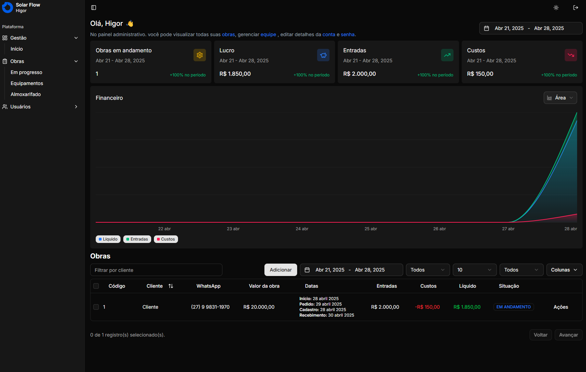

# :desktop_computer: Solar Flow



Sistema completo para obras de energia solar, ideal para aplicações modernas com integração a diversos serviços em nuvem e autenticação segura.

## :rocket: [Solar Flow](https://solar-flow-pi.vercel.app/)

## :fire: Run

- Database (Postgres): `docker compose up -d`
- Install: `yarn && yarn db:push && yarn db:seed`
- Development (Port 3000): `yarn dev`
- Build: `yarn build`

## :triangular_flag_on_post: Environment Variables

- Batabase: `DATABASE_URL`

- URL: `NEXT_PUBLIC_APP_URL`

- Secret: `AUTH_SECRET`

- Resend Key: `RESEND_API_KEY`

- Cloudinay name: `CLOUDINARY_CLOUD_NAME`
- Cloudinary Key: `CLOUDINARY_API_KEY`
- Cloudinary Secret: `CLOUDINARY_API_SECRET`
- Cloudinary Variable: `CLOUDINARY_ENV_VARIABLE`

## :test_tube: Test

Você pode utilizar os seguintes dados para acessar o sistema após executar o seed:

- Email: adm@email.com
- Senha: pass123ASD

## :globe_with_meridians: Routes

Rota base da plataforma de uso do sistema, voltada para clientes autenticados (como donos de empresas):

```

  /plataforma/
  ├── page.tsx                   # Dashboard principal
  ├── entrar.tsx                 # Login de usuário
  ├── recuperar-senha.tsx        # Solicitação de recuperação de senha
  ├── redefinir-senha.tsx        # Redefinição com token

  ├── conta/
  │   └── page.tsx               # Dados da conta
  │   └── seguranca.tsx          # Configurações de senha/autenticação

  ├── obras/
  │   └── page.tsx               # Lista geral de obras
  │   └── almoxarifado.tsx       # Materiais/estoque das obras
  │   └── calendario.tsx         # Cronograma e planejamento
  │   └── desempenho.tsx         # Métricas e progresso das obras
  │   └── equipamentos.tsx       # Controle de máquinas/equipamentos

  ├── usuarios/
  │   └── page.tsx               # Gestão de usuários
  │   └── clientes.tsx           # Gestão de clientes vinculados

```

Acesso administrativo da plataforma (Administradores)

```

  /gestao/
  ├── page.tsx                   # Dashboard da gestão
  ├── entrar.tsx                 # Login de gestor
  ├── recuperar-senha.tsx        # Solicitação de recuperação de senha
  ├── redefinir-senha.tsx        # Redefinição com token

  ├── conta/
  │   └── page.tsx               # Dados da conta do gestor
  │   └── seguranca.tsx          # Configurações de segurança

  ├── empresas.tsx               # Gestão de empresas cadastradas
  ├── usuarios.tsx               # Gestão de usuários da plataforma

```

Área pública:

```

  /
  ├── page.tsx                      # Landing page pública
  ├── planos.tsx                    # Página de planos e preços
  ├── politicas-de-privacidade.tsx  # Política de privacidade
  ├── termos-de-uso.tsx             # Termos de uso
  ├── sobre-nos.tsx                 # Sobre a empresa/plataforma
  ├── suporte.tsx                   # Ajuda e suporte

```

Erros:

```

  /error.tsx                         # Página genérica de erro (problemas do servidor, API etc.)
  /not-found.tsx                     # Página 404 personalizada (rota não encontrada)

```

## :copyright: Author

<a href="https://github.com/higoreduardob">
  <br>
  <sub><b>Higor Eduardo</b></sub>
</a>

Desenvolvido com :heart: por **Higor Eduardo** — [higoreduardob](https://github.com/higoreduardob)